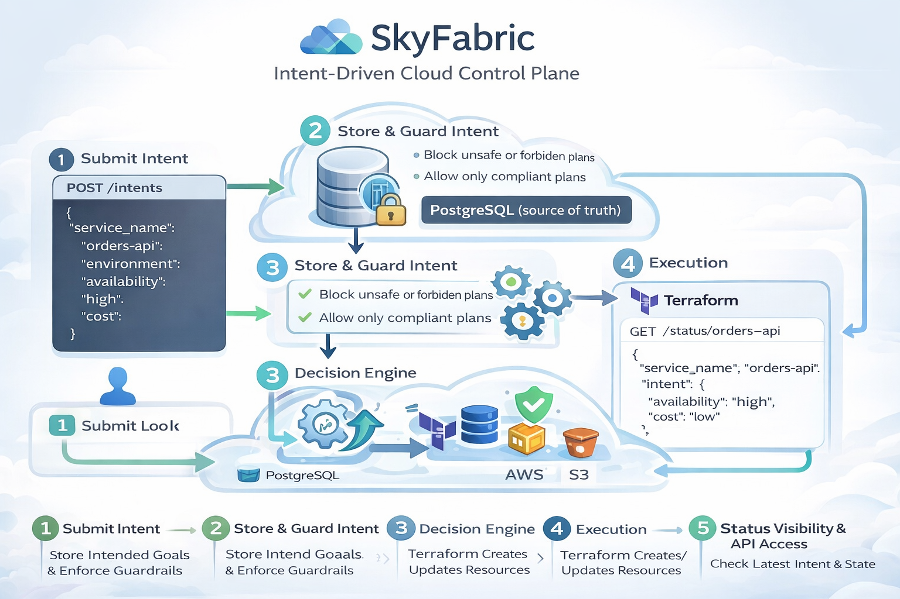

# 🌐 SkyFabric

✨ **SkyFabric** is a **central system** that lets you describe **what you want**,  and then **handles everything needed to make it run and stay healthy** across cloud environments.

🧠 You tell SkyFabric **your intent**:
> “I want my service running in production, always available, and not expensive. ”

⚙️ SkyFabric then:
- Decides **where** it should run ☁️
- Deploys it **correctly** 🚀
- Continuously **watches it** 👀
- **Fixes issues or alerts humans** when something goes wrong 🚨

🤝 You stop manually managing infrastructure.  
🎯 You focus on building software.  


## 🧠 One-Line Truth

**SkyFabric is an intent-driven cloud control plane that translates high-level intent into safe, cost-aware, and continuously reconciled infrastructure using Infrastructure as Code.**


## 🧩 Real-Life Problems Developers Face (Without SkyFabric)

> In many real companies, infrastructure is spread across clouds:
> - **AWS** for backend services  
> - **GCP** for data and analytics  
> - **Azure** for authentication or enterprise integrations  

| 🚧 Core Problem Area | 😣 What Developers Actually Face in Real Life |
|---------------------|----------------------------------------------|
| Fragmented environments | Backend on AWS, data on GCP, auth on Azure — no single place to manage everything |
| Manual service deployments | Separate deployment logic and workflows for each cloud and environment |
| No single source of truth | Unclear which service version is running where and with which configuration |
| Configuration drift | Manual changes in one cloud silently break production stability |
| Slow incident response | During outages, teams first struggle to identify **which cloud** is failing |
| Inconsistent security rules | Strong IAM rules in one cloud, misconfigured or open access in another |
| Hidden cost behavior | AWS, GCP, and Azure bills grow independently with no unified explanation |

💡 **These problems appear daily in real production teams and grow worse as systems scale across clouds.**


## 🔄 How SkyFabric Changes the Developer Experience (Before → After)

| 🚧 Without SkyFabric (Before) | ✅ With SkyFabric (After) |
|------------------------------|--------------------------|
| Services managed separately across AWS, GCP, and Azure | One central system manages services across all clouds |
| Manual, cloud-specific deployments | One intent-driven deployment flow |
| Engineers unsure what is running where | Clear visibility into service state and placement |
| Configuration drift causes unexpected failures | Desired state defined once and continuously enforced |
| Slow and confusing incident investigation | Faster detection of mismatches and failures |
| Security rules differ per cloud | Consistent security and access enforcement |
| Cost issues discovered only after billing | Central visibility into cost-related behavior |

💡 **With SkyFabric, developers describe what they want once,  
and the platform takes responsibility for making reality match that intent.**


## 📌 What SkyFabric IS / IS NOT

### ✅ SkyFabric IS
- An **intent-based control plane** for cloud infrastructure
- A **policy-aware orchestration system** built on Terraform
- A **single source of truth** for desired infrastructure state
- A **reconciliation engine** that detects and reports drift

### ❌ SkyFabric IS NOT
- A PaaS or Heroku-like platform
- A Kubernetes replacement
- A cloud provider abstraction layer
- A UI-first management tool


## 🧠 Simple Mental Model (Uber Analogy)

Think of **SkyFabric like Uber for infrastructure**:

| Uber | SkyFabric |
|---|---|
| You say where to go | You say what you want |
| Uber decides route | SkyFabric decides infra |
| Driver executes | Terraform executes |
| Uber monitors trip | SkyFabric reconciles state |

You never drive the car.  
You never touch the cloud.

## 🧱 System Architecture (Single Source of Truth)

```text
User / Team
   │
   ▼
Intent API (FastAPI)
   │
   ▼
Decision Engine (Rules)
   │
   ▼
Guardrails (Policy Checks)
   │
   ▼
Execution Plan
   │
   ▼
Terraform Executor
   │
   ▼
Cloud (AWS)
```

## 🧱 Design Rationale (Why This Architecture)

- **Intent-Driven Model**: Separates *what the user wants* from *how it is implemented*, reducing human error.
- **Terraform as Executor**: Leverages proven IaC tooling instead of reinventing cloud provisioning logic.
- **PostgreSQL as Source of Truth**: Ensures durable, versioned storage of intents and execution state.
- **Reconciliation Loop**: Prevents silent drift by continuously comparing desired and actual cloud state.
- **Control Plane Pattern**: Mirrors real platform-engineering systems used in production environments.


## 🔁 How SkyFabric Works (Step-by-Step)





### 1️⃣ Submit Intent

```http
POST /intents
Example:
{
  "service_name": "orders-api",
  "environment": "production",
  "availability": "high",
  "cost": "low"
}
```

### 2️⃣ Intent Stored
- Stored immutably in PostgreSQL
- Becomes the single source of truth

### 3️⃣ Decision Engine
- Converts intent → decision plan  
- Example:
  - high availability → multi-instance  
  - low cost → cost-optimized

### 4️⃣ Guardrails (Safety)
- Blocks unsafe, expensive, or forbidden changes
- Prevents outages, cost spikes, and human mistakes

### 5️⃣ Execution
- Approved plan → Terraform variables
- Terraform applies cloud infrastructure

### 6️⃣ Reconciliation (Drift Detection)
- Compares desired state vs actual state
- Reports **IN_SYNC** or **DRIFTED**
- Prevents silent infrastructure drift

###📡 Visibility (Status API)
SkyFabric exposes full system visibility:

```http GET /status/{service_name}
🧪 Example Output
{
  "service_name": "orders-api",
  "decision": {
    "availability_plan": "multi-instance",
    "cost_plan": "cost-optimized"
  },
  "execution_plan": {
    "actions": [
      { "type": "deploy_service" },
      { "type": "configure_availability" },
      { "type": "apply_cost_policy" }
    ]
  },
  "reconciliation_status": "IN_SYNC"
}

```

## ⚠️ Failure Scenarios & Handling

SkyFabric is designed with failure as a first-class concern:

- ❌ **Terraform apply fails** → Execution is halted and failure is recorded.
- ⚠️ **Partial execution** → State is marked inconsistent and surfaced via status API.
- 🚫 **Policy violation** → Execution is blocked before any cloud change occurs.
- ☁️ **Cloud API failure** → Error is captured and reported without corrupting state.
- 🔁 **Retry safety** → Idempotent intent execution prevents duplicate or unsafe changes.

## 🔐 Security Model & Guardrails

- 🔑 **IAM-scoped execution roles** limit Terraform permissions to approved resources.
- 🧑‍💼 **Intent submission boundaries** define who can request changes.
- 🛑 **Guardrails block unsafe changes** (high cost, forbidden regions, insecure configs).
- 📜 **Immutable intent records** provide a full audit trail of infrastructure decisions.

Security is enforced **before execution**, not after incidents.


## 📈 Scalability & Performance Thinking

- ⚙️ **Stateless APIs** allow horizontal scaling of the control plane.
- 🔁 Terraform executions are **isolated per intent**.
- 🧠 Decision engine scales independently from execution layer.
- 🚦 Execution frequency can be rate-limited to control load.

Designed to scale **safely**, not aggressively.

## 💰 Cost Awareness & Trade-offs

- 💸 Control-plane costs remain low due to stateless services.
- ⚖️ Trade-off: Terraform execution is slower than direct SDK calls but safer.
- 📉 Reconciliation frequency is configurable to balance cost vs freshness.
- 🚫 Prevents accidental high-cost infrastructure changes before deployment.

## 🛠 Tech Stack

- **Backend:** FastAPI (Python)
- **Database:** PostgreSQL
- **IaC:** Terraform
- **Cloud:** AWS
- **Architecture:** Control Plane + Reconciliation Loop

## ⚖️ Engineering Trade-offs & Decisions

- **Rules engine over ML** → Predictable, explainable decisions.
- **Terraform over SDK calls** → Proven safety and state management.
- **API-driven over UI-driven** → Enables automation and CI/CD integration.
- **Single-cloud execution (AWS)** → Focus on correctness before expansion.

All choices were **intentional**, not accidental.

## 🚫 Explicit Limitations

- AWS is the only execution target currently
- No graphical UI (API-only control plane)
- Manual approval flows not yet implemented
- Reconciliation is scheduled, not continuous

These are **scope decisions**, not oversights.


## ▶️ How to Run Locally (Minimal)

```bash
# Start API
uvicorn main:app --reload

# Initialize Terraform
terraform init

# Apply execution plan
terraform apply
```

## 🧠 What This Project Demonstrates

This project demonstrates ability in:

- Control plane design
- Infrastructure as Code
- Policy enforcement
- Cloud safety & governance
- State reconciliation
- Platform engineering mindset

This is **not a CRUD app**.  
This is **infrastructure control logic**.


## 🔮 Future Enhancements

- Multi-cloud execution (AWS / GCP / Azure)
- Policy-as-code (OPA / Sentinel)
- Auto-reconciliation loop
- Web dashboard
- CI/CD integration


### 🛠️ How to Contribute

1. 🍴 Fork the repo
2. 📦 Create a new feature branch: `git checkout -b feature-name`
3. ✅ Make your changes and test them
4. 📬 Submit a pull request describing your enhancement

 🤝 Let's Build This Together!
Made with 🤍 by **Manas Gantait**  
